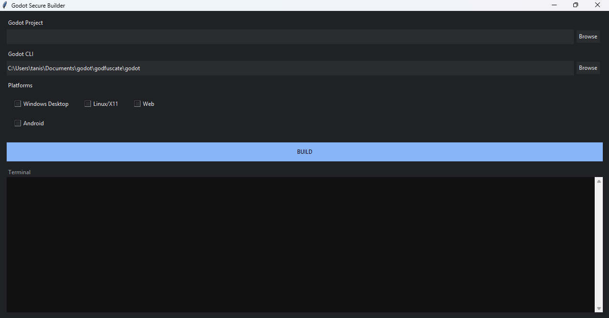

# Godfuscate

A GUI-based build tool for **Godot projects** that performs **randomized obfuscation** and exports builds for multiple platforms.
Each build generates **different identifiers**, making reverse engineering harder.

---



# Features

* Dark minimal UI
* Project browser
* Godot CLI selector
* Platform selection (Windows / Android / Web / Linux)
* Build terminal output
* Random variable/file renaming
* Confusing character obfuscation (`Il1O0`)
* Word-pool based naming
* Per-build randomization
* Temporary build copy (`build/tmp`)
* Multi-platform export
* Configurable security via `security.json`

---

# Folder Structure

```
builder/
│
├── main.py
├── security.json
├── word_pool.txt
└── godot (optional CLI binary)
```

---

# Installation

## 1. Install Python

Python 3.9+ recommended

Check:

```
python --version
```

---

## 2. Download Godot CLI

Download from:
[https://godotengine.org/download](https://godotengine.org/download)

Place executable:

Windows:

```
builder/godot.exe
```

Linux:

```
builder/godot
```

Or select manually in UI.

---

## 3. No dependencies required

Uses only:

* tkinter
* standard python libs

---

# Running

```
python main.py
```

GUI will open.

---

# Usage

## Step 1 — Select Godot Project

Click **Browse** and select folder containing:

```
project.godot
```

---

## Step 2 — Select Godot CLI

Either:

* leave default (local folder)
* browse to Godot executable

---

## Step 3 — Choose Platforms

Check:

* Windows Desktop
* Android
* Web
* Linux

---

## Step 4 — Click BUILD

The tool will:

1. Create `/build`
2. Create `/build/tmp`
3. Copy project
4. Obfuscate names
5. Rename files
6. Export builds
7. Output to platform folders

---

# Output Structure

```
project/
    build/
        windows/
        android/
        web/
        linux/
        tmp/
```

`tmp` = obfuscated temporary project

---

# security.json

Controls obfuscation strength.

Example:

```json
{
  "min_length": 12,
  "max_length": 24,
  "prefix": "__",
  "suffix": "",
  "use_numbers": true,
  "use_uppercase": true,
  "use_lowercase": true,
  "confusing_names": true,
  "rename_files": true,
  "rename_functions": true,
  "rename_variables": true,
  "rename_classes": true,
  "shuffle_methods": true
}
```

---

# word_pool.txt

Optional words used in names.

Example:

```
quantum
cipher
entropy
vector
lambda
shadow
matrix
omega
flux
```

Generated names:

```
__quantumIl1O0x91
__shadowLIlI0k29
```

Each build is different.

---

# Important Notes

* Original project is never modified
* Obfuscation only happens in `build/tmp`
* Every build produces different names
* Do not commit `build/tmp` to git

---

# Recommended Workflow

```
develop normally
↓
run builder
↓
release build
↓
delete build/tmp
```


# Warning

This tool increases difficulty but does NOT make your game unhackable.
Client-side software can always be reverse engineered.